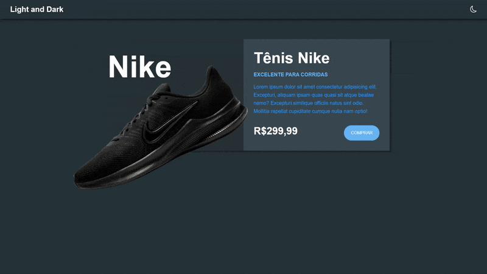

# Projeto Dark/Light Mode

> project_dark_light_mode foi feito para prática das tecnologias HTML, CSS e JavaScript, sua principal funcionalidade é alternar em mode de claro e escuro. A principal referência para esse projeto foi: https://youtu.be/i1dNnS6pXAo?si=u0LiFn7Up9aybL1z

### Tecnologias usadas

O projeto utiliza as seguintes tecnologias:

- HTML
- CSS
- JavaScript
